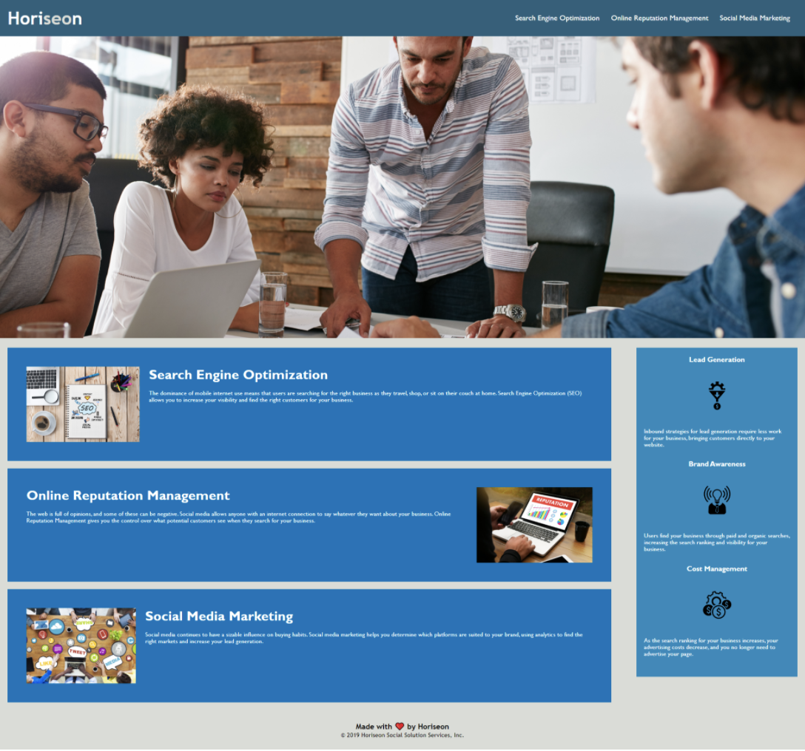

# HW1-refactor

## Description

The purpose of this project was the refactor the Horiseon website homepage. The goal was to refactor the existing site to make it more accessible. This allows the website to be easily used by people with disabilities as they can access it using assistive technologies like video captions, screen readers, and braille keyboards. Accessibility also results in higher ranks in search engines like Google.

## Links
- [Deployed Website](https://erinlim2001.github.io/HW1-refactor/ "Deployed Website")
- [Code Repository](https://github.com/erinlim2001/HW1-refactor)

## Installation

1. Clone the repo
2. It will contain an an index.html file and an assets folder which include the images and CSS files

## Usage

You will be able to view the website on a desktop web browser once it is deployed.

## Credits

### Tutorials Used
* [https://www.w3schools.com/tags/tag_nav.asp](https://www.w3schools.com/tags/tag_nav.asp)
* [https://www.w3schools.com/html/html5_semantic_elements.asp](https://www.w3schools.com/html/html5_semantic_elements.asp)

## License

MIT License

Copyright (c) 2021 Erin Lim

Permission is hereby granted, free of charge, to any person obtaining a copy
of this software and associated documentation files (the "Software"), to deal
in the Software without restriction, including without limitation the rights
to use, copy, modify, merge, publish, distribute, sublicense, and/or sell
copies of the Software, and to permit persons to whom the Software is
furnished to do so, subject to the following conditions:

The above copyright notice and this permission notice shall be included in all
copies or substantial portions of the Software.

THE SOFTWARE IS PROVIDED "AS IS", WITHOUT WARRANTY OF ANY KIND, EXPRESS OR
IMPLIED, INCLUDING BUT NOT LIMITED TO THE WARRANTIES OF MERCHANTABILITY,
FITNESS FOR A PARTICULAR PURPOSE AND NONINFRINGEMENT. IN NO EVENT SHALL THE
AUTHORS OR COPYRIGHT HOLDERS BE LIABLE FOR ANY CLAIM, DAMAGES OR OTHER
LIABILITY, WHETHER IN AN ACTION OF CONTRACT, TORT OR OTHERWISE, ARISING FROM,
OUT OF OR IN CONNECTION WITH THE SOFTWARE OR THE USE OR OTHER DEALINGS IN THE
SOFTWARE.

    

